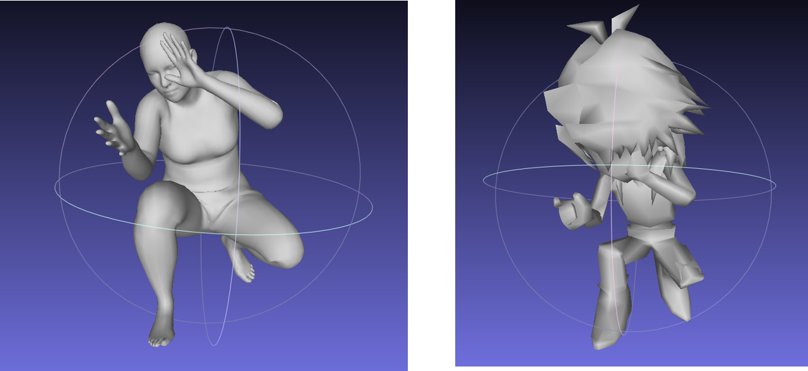

# Pose2Carton 

EE228 课程大作业 利用3D骨架控制3D卡通人物 (https://github.com/yuzhenbo/pose2carton) 

数据组别： 18 (初始分配组别)

数据类型： 20组匹配

# Maya 环境配置

在Autodesk官网通过学生验证后，先下载了2022版本的Maya。这一版本的Maya在安装过程中出现的最大问题在于安装numpy库时，使用教程中的网址安装无法成功，提示版本不符。综合考虑到一般的wheel文件并不适合Maya使用，而网上没有找到可以替代的其他资源，故放弃2022版本的安装。

在2020版本的安装过程中，安装numpy一度也遇到了困难，安装时显示未找到。登录该网址后发现该wheel文件变为404 notfound。后续在数天后再次尝试安装时一切正常结束。

# 匹配流程

xxx (这里请简单描述你熟悉/使用 匹配代码的流程，可以简述对代码的理解/各个函数作用等。)

# 新增脚本说明

xxx (如果你写了自己的脚本来处理数据或进行可视化，请在这里进行相关说明(如何使用等)； 如果没有，请忽略该模块。)

# 项目结果

xxx. (这里放置来自你最终匹配结果的截图， 如

# 协议 
本项目在 Apache-2.0 协议下开源

所涉及代码及数据的所有权以及最终解释权归倪冰冰老师课题组所有. 
